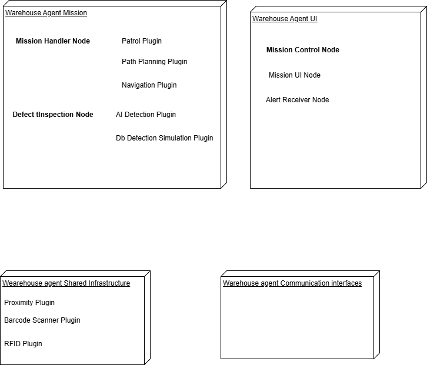
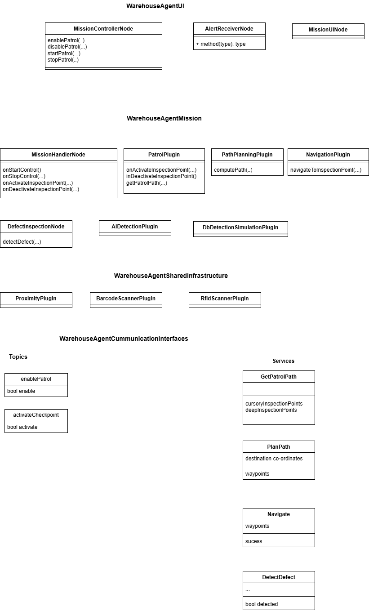
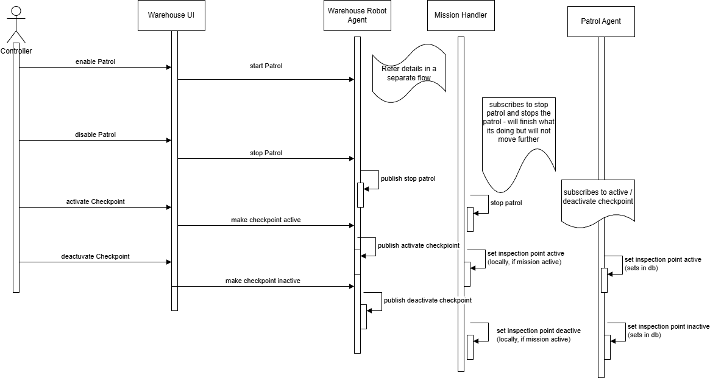
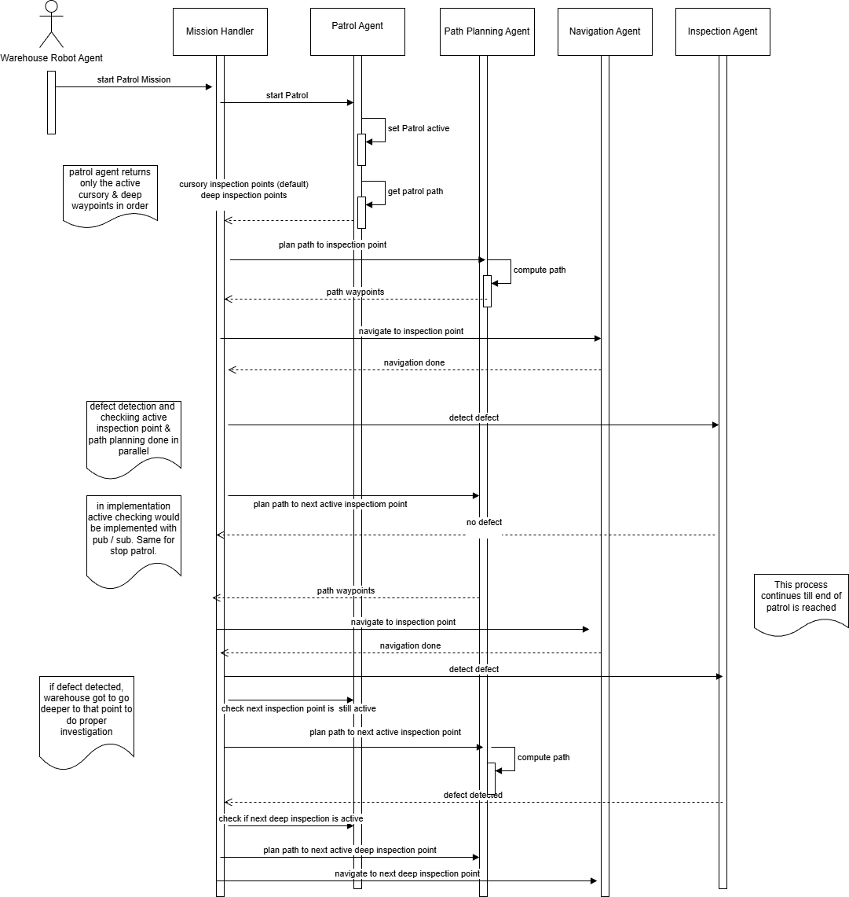

# System Architecture

## Overview

The Autonomous Warehouse Inspection & Monitoring System uses an **event-driven ROS2 architecture** with asynchronous service interactions and concurrent task execution, coordinated by a non-blocking mission orchestrator.

The system is organised into four logical packages, each with clearly defined responsibilities:

| Package | Responsibility |
|---------|---------------|
| Warehouse Agent Mission | Core patrol, navigation, inspection, and detection |
| Warehouse Agent UI | Operator control and alert display |
| Warehouse Agent Shared Infrastructure | Shared sensor plugins |
| Warehouse Agent Communication Interfaces | Shared ROS2 message and service definitions |

---

## Architectural Layers

### 1. UI Layer — Warehouse Agent UI
Handles operator commands and alert consumption.

- `MissionControllerNode` — publishes patrol control and checkpoint configuration commands
- `MissionUINode` — operator interface for patrol control and checkpoint management
- `AlertReceiverNode` — receives and displays structured defect alerts

### 2. Mission & Orchestration Layer
Central coordinator of the patrol lifecycle.

- `MissionHandlerNode` — orchestrates navigation, path planning, and inspection. Maintains runtime mission state. Subscribes to control commands and coordinates all execution agents.

### 3. Execution Plugins Layer
Handles robot movement and patrol behaviour.

- `PatrolPlugin` — maintains ordered list of active inspection points (cursory + deep). Provides next inspection targets to the mission handler.
  - `DbPatrolPlugin` *(Phase 1)* — determines patrol route and checkpoint ordering from a predefined database configuration. Provides deterministic, structured patrol sequences.
  - `RLPatrolPlugin` *(Phase 2)* — replaces database-driven ordering with a reinforcement learning model that dynamically determines the optimal checkpoint sequence. Nav2 handles actual path planning and navigation execution.
- `PathPlanningPlugin` — computes paths to inspection targets via Nav2. Returns waypoints.
- `NavigationPlugin` — executes robot movement to waypoints via Nav2. Reports completion.

### 4. Inspection & Sensing Layer
Performs defect detection and sensor integration at checkpoints.

- `DefectInspectionNode` — performs inspection at checkpoints. Delegates detection to AI or simulation plugins.
  - `AIDetectionPlugin` — AI-based detection and classification (Phase 3)
  - `DbDetectionSimulationPlugin` — simulation-driven detection using defect database (Phase 1)
- Shared sensor plugins (Warehouse Agent Shared Infrastructure):
  - `ProximityPlugin` — ray-based proximity sensing with threshold logic
  - `BarcodeScannerPlugin` — barcode / QR code scanning simulation
  - `RfidScannerPlugin` — RFID identity validation simulation

---

## Component Diagram



---

## Class Diagram



### Key Interfaces

**WarehouseAgentUI**

| Node | Key Methods |
|------|------------|
| `MissionControllerNode` | `enablePatrol()`, `disablePatrol()`, `startPatrol()`, `stopPatrol()` |
| `AlertReceiverNode` | `method(type): type` |
| `MissionUINode` | — |

**WarehouseAgentMission**

| Node / Plugin | Key Methods |
|--------------|------------|
| `MissionHandlerNode` | `onStartControl()`, `onStopControl()`, `onActivateInspectionPoint()`, `onDeactivateInspectionPoint()` |
| `PatrolPlugin` | `onActivateInspectionPoint()`, `inDeactivateInspectionPoint()`, `getPatrolPath()` |
| `PathPlanningPlugin` | `computePath()` |
| `NavigationPlugin` | `navigateToInspectionPoint()` |
| `DefectInspectionNode` | `detectDefect()` |

---

## Communication Architecture

The system uses a hybrid ROS2 communication model:

- **Topics** → asynchronous, event-driven control and state changes
- **Services** → asynchronous request/response interactions between execution agents

### ROS2 Topics

| Topic | Publisher | Subscriber(s) |
|-------|-----------|--------------|
| `enablePatrol` (`bool enable`) | `MissionControllerNode` | `MissionHandlerNode` |
| `activateCheckpoint` (`bool activate`) | `MissionControllerNode` | `MissionHandlerNode`, `PatrolPlugin` |

### ROS2 Services

| Service | Server | Client |
|---------|--------|--------|
| `GetPatrolPath` (returns: `cursoryInspectionPoints`, `deepInspectionPoints`) | `PatrolPlugin` | `MissionHandlerNode` |
| `PlanPath` (in: `destination coordinates` · out: `waypoints`) | `PathPlanningPlugin` | `MissionHandlerNode` |
| `Navigate` (in: `waypoints` · out: `success`) | `NavigationPlugin` | `MissionHandlerNode` |
| `DetectDefect` (out: `bool detected`) | `DefectInspectionNode` | `MissionHandlerNode` |

---

## Execution Pattern

The system follows an **orchestrator-led workflow with partial parallelism**.

### Main Patrol Loop

1. Retrieve active patrol points (cursory + deep) from `PatrolPlugin`
2. Plan path to current inspection point (`PathPlanningPlugin`)
3. Navigate to inspection point (`NavigationPlugin`)
4. Trigger inspection (`DefectInspectionNode`)
5. Evaluate result → continue or escalate

### Parallel Behaviour
While defect detection is in progress at the current inspection point, path planning for the next active inspection point executes concurrently — eliminating idle time between checkpoints.

### Conditional Flow

```
No defect detected  →  continue patrol to next active inspection point
Defect detected     →  check if deep inspection point is active
                        →  plan + navigate to deep inspection point
                        →  perform detailed inspection
                        →  resume patrol
```

### Runtime Interruptions
- Patrol can be stopped asynchronously at any point
- Checkpoints can be activated or deactivated dynamically during patrol execution
- Mission Handler completes current task gracefully before stopping — does not halt mid-navigation

---

## Interaction Diagrams

### Patrol Control & Configuration Flow (UI → Robot System)

Actors: `Warehouse UI` → `Robot Agent` → `Mission Handler` → `Patrol Agent`



**Key behaviour:**
- Warehouse UI publishes high-level control commands (enable/disable patrol, activate/deactivate checkpoints)
- Robot Agent acts as bridge — converts UI actions into system-level pub/sub events
- Mission Handler subscribes to patrol control commands, stops patrol gracefully, updates local mission state
- Patrol Agent subscribes to checkpoint activation/deactivation, persists checkpoint state

**Design intent:** Clear separation between control intent (UI), execution state (Mission Handler), and checkpoint state management (Patrol Agent).

### Patrol Execution & Inspection Flow (Core Runtime Loop)

Actors: `Mission Handler` → `Patrol Agent` → `Path Planning Agent` → `Navigation Agent` → `Inspection Agent`



**Key behaviour:**
- Mission Handler initiates patrol, requests active inspection points
- Patrol Agent returns ordered list of active cursory and deep checkpoints
- Path Planning Agent computes waypoints to each inspection point
- Navigation Agent executes movement and reports completion
- Inspection Agent performs defect detection — outputs defect detected / no defect
- On defect detection: deep inspection point is checked, path planned, robot navigated to precise location
- Process continues until all patrol points are completed or patrol is stopped externally

---

## Key Design Characteristics

**Orchestrator-centric but not sequential**
Central coordination via `MissionHandlerNode` with concurrent task execution — planning and inspection overlap to maximise efficiency.

**Hybrid communication model**
Topics for control and state changes; services for execution steps. Agents react to events rather than being tightly coupled.

**Plugin-based modular architecture**
Patrol, path planning, navigation, and detection components are independently replaceable. AI detection plugins can be swapped without affecting navigation or orchestration layers.

**Dynamic runtime behaviour**
Checkpoints and patrol state can change during execution. The system responds to runtime configuration changes without requiring restart.

**Hierarchical inspection model**
Cursory inspection provides broad aisle-based coverage. Deep inspection is triggered on defect detection for precise rack-face and shelf-position level verification.

**Extensible sensing and detection**
Multiple sensor inputs and detection strategies supported. Custom Gazebo plugins extend simulation where native sensor support is absent.
